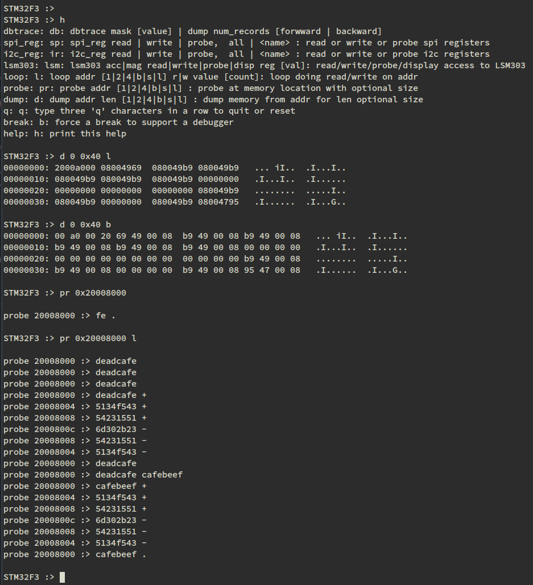

About this repo
==========================================================

## NOTE BENE

This is a work in progress.

I have added some sources and am currently working on documenting all that I have uploaded, along with adding unit tests.

## What's new

I have written 'brickless' bootloaders before and was asked about them recently.  I have decided to implement one for this board.  See the code in code/tools.

## Introduction

A common question on reddit subs is often one of how to get started in embedded systems.  My answer is often to start with the STM32F3 Discovery board.  My reasoning is that it has some devices on it, namely accelerometer, gyroscope and magnetometer that can be programmed to generate data.  That way, the user gets to work on interrupt handlers and other subjects without requiring an additional board.

While the sources here are targeted at the STM32F3 Discovery, many of the sources can be used for other chips and boards.

Some of this material will be intended for people who are just starting with embedded systems, who know how to program but are unfamiliar with handling chips.  I hope that doesn't turn off people with a more advanced background

## What's here

In the ./doc directory, there's a series of pages that will hopefully lead a new user through setting up the board and perform certain tasks.  In the ./code directory, there are source and header files for a variety of functions.

Some of the source files are set up so that they can be built on a Linux system as standalone applications to try out features that will be run on the target platform.  Most of the sources can be compiled into standalone programs which will run unit tests.

For exmaple, the file shell.c can be compiled into a stand alone program which demonstrates a shell function.  The file mem_debug.c can be compiled, using the routines in shell.c, to form a stand alone program which demonstrates memory dumping, probing and looping.

On the target hardware, it looks like this:

The first command executed is the help command.  The following commands are shown:

    dbtrace - a command to use a trace buffer to track data through time critical code; this is essentially a logic analyzer for software
	spi_reg - manipulate the SPI controller registers of the MPU
	i2c_reg - manipulate the I2C controller registers of the MPU
	lsm303 - manipulate the registers of the accelerometer and magnetometer
	loop - do scope loops
	probe - peek and poke memory
	dump - dump memory
	break - this is an easy place to set a break point to break into a debugger

Note that the commands have a long name and an abbreviation, e.g., dump, d.
Note also that memory sizes can be specified for all accesses.  It is not shown here, but a leading hash symbol, \#, notes a comment.  This allows commented command lists to be stored in a text file and run via cut-n-paste.

The first command run is help.

The second command run is dump and it shows memory dump as 32 bit entities and as bytes.

The third command run is the probe command.  The probe command is pointed at a region of SRAM not used by the program.  The + key increments the address, the - key decrements it.  Hitting the carriage-return causes the location to be read again.  A period or q ends the probe.  This paradigm is used for register accesses in the MPU devices and attached devices.

Three quits in a row causes the system to be reset.

Current code size is around 8kbytes of app code and 8 kbytes of system code.

## Getting started

The files in the ./doc directory are a series of tasks to lead a programmer through setting up a board.  The tasks are titled with some number of digits and a name.  The digits start at 00 and are a guide for working through the material.

For now, the ./projects directory has a project, i2c, and a some documentation about it, i2c.md.

## License

This is licensed under the MIT license.
