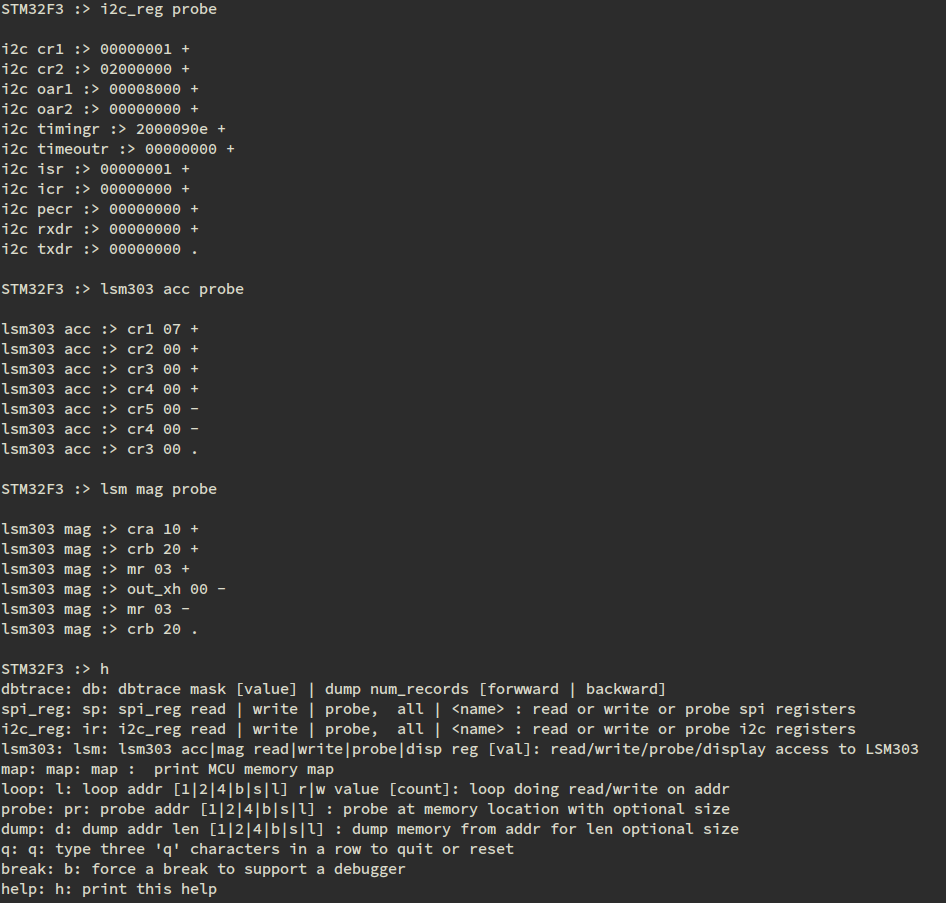

I2C project
===========================================

## Intooduction

This project allows the user to query the I2C registers in the processor and then query the LSM303 chip containing the accelerometer and magnetometer.

Here is an example:

This shows a probe of the i2c controller registers, using + and - to navigate.  Then, i2c is used to communicate with the LSM303 to probe the accelerometer and magnetometer registers.

## Using this project

Create a directory to hold the code and the eclipse workspace.  I use the following layout:

    I2C/i2c
    I2C/wkspc

Open the project file (\*.ioc) with STM32CubeMX and save (File -> Save Project As) it to I2C/i2c.  When you are ready, generate code (Project -> Generate Code).  Code should be added to I2C/i2c.  In I2C/i2c, you should see Drivers, Inc, Src, and startup directories.

You will need to add code to two of these directories.  In Inc, do symbolic links to the repo:

    for ii in dbt.h probe.h micro_console.h micro_types.h micro_util.h console.h micro_stdio.h list.h shell.h byte_fifo.h format.h mem_db.h ; do ln -s PATH_TO_YOUR_REPO/$ii ; done

Into Src, add the following:

    for ii in spi_reg.c dbt.c probe.c lsm303_driver.c i2c_reg.c byte_fifo.c micro_stdio.c shell.c format.c mem_db.c micro_util.c ; do ln -s  PATH_TO_YOUR_REPO/$ii ; done

Some code needs to be added to files:

Into main.c, add the following:

1) Into the space allowed for USER CODE BEGIN Includes, add:
~~~
    #include "shell.h"
    #include "console.h"
    #include "micro_console.h"
    #include "mem_db.h"
    #include "byte_fifo.h"
    #include "micro_stdio.h"
    #include "dbt.h"
~~~
2) Into the main while(1) loop, at USER CODE BEGIN 3, add:
~~~
    int done = 0;
    int shell_arg = 1;

    shell_init("\r\nSTM32F3 :> ");
    mem_db_init();

    extern void lsm303_driver_init();
    lsm303_driver_init();
    extern void i2c_reg_init();
    i2c_reg_init();
    extern void spi_reg_init();
    spi_reg_init();
    extern void dbt_cmd_init();
    dbt_cmd_init();

    while(!done) {
        shell_arg = shell_func(shell_arg);
        if(shell_arg < 0) {
            done = 1;
        }
    }

    shell_exit();
~~~
Into stm32f3xx\_it.c, in USART1\_IRQHandler, at USER CODE BEGIN USART1\_IRQn 1, add:

    extern usart1_irq_handler();
    usart1_irq_handler();

## SW4ST

This code is set up for the System Workbench 4 ST version of eclipse.  Although ST has purchased Atollic, I have more experience on SW4ST.  I will migrate this code at some later date.  This version of eclipse has the feature of compile whatever code is in the Src directory.  By adding symbolic links to the directory, files are pulled in but not copied.  There is a single copy, the one in your repo.

